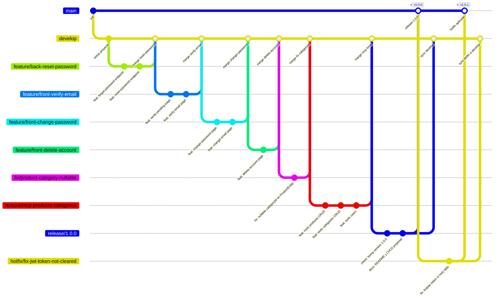
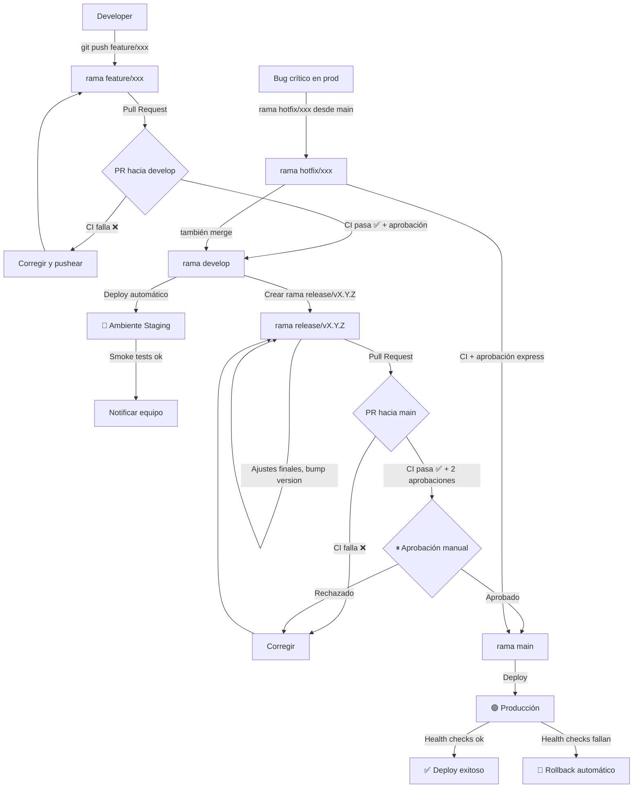

# Propuesta de Pipeline CI/CD — Practico Final DS

## 1. Descripción del Proyecto

**Practico Final DS** es una aplicación full-stack de gestión de productos y categorías con autenticación de usuarios, verificación de email y recuperación de contraseña.

### Tecnologías

| Capa | Tecnología |
|------|------------|
| Frontend | Angular 21, Bootstrap 5, Bootstrap Icons, sistema de toasts propio con Signals |
| Backend | NestJS 11, TypeORM, PostgreSQL, JWT (passport-jwt), Nodemailer, bcrypt |
| MCP Server | TypeScript, Model Context Protocol SDK, Zod, Axios |
| Infraestructura | Node.js 22, npm, Docker (PostgreSQL) |

### Estructura del monorepo

```
Practico-Final-DS/
├── back/      # API NestJS
├── front/     # SPA Angular
└── mcp/       # Servidor MCP
```

---

## 2. Cómo correr el proyecto

### Requisitos previos

- Node.js 22
- Docker y Docker Compose
- Servicio de email (cuenta SMTP, Gmail, Resend, etc.)

### Instalación

**1. Instalar dependencias**
```bash
npm install
cd back && npm install && cd ..
cd front && npm install && cd ..
cd mcp && npm install && cd ..
```

**2. Configurar variables de entorno**
```bash
cp back/.env.example back/.env
# Editar back/.env con los datos reales
```

**3. Correr el proyecto completo**
```bash
npm run start
```

Esto levanta automáticamente, en orden:
- Docker Compose con PostgreSQL y pgAdmin (vía hook `preback`)
- Backend NestJS en `http://localhost:3000`
- Frontend Angular en `http://localhost:4200`

Para detener Docker al terminar:
```bash
npm run stop
```

Para el servidor MCP:
```bash
cd mcp && npx tsx src/index.ts
```

---

## 3. Estrategia de Ramas — GitFlow


### Ramas principales

| Rama | Propósito | Deploy |
|------|-----------|--------|
| `main` | Código en producción, siempre estable | Producción |
| `develop` | Integración continua de features | Staging |

### Ramas de soporte

| Tipo | Rama | Sale de | Merge a |
|------|-------------|---------|---------|
| Feature | `feature/nombre-descriptivo` | `develop` | `develop` |
| Release | `release/vX.Y.Z` | `develop` | `main` + `develop` |
| Hotfix | `hotfix/nombre-del-bug` | `main` | `main` + `develop` |
| Chore | `chore/nombre` | `develop` | `develop` |

### Ejemplos concretos de este proyecto

```
feature/front-verify-email       # Páginas verify-pending y verify-email
feature/front-change-password    # Formulario cambio de contraseña desde perfil
feature/front-delete-account     # Página eliminación de cuenta
feature/back-reset-password      # Endpoints forgot/reset password en NestJS
feature/mcp-products-categories  # Tools MCP para products y categories
hotfix/fix-jwt-token-not-cleared # Token no se limpiaba al expirar (BUG-012)
chore/remove-unused-imports      # Limpieza de imports innecesarios
release/1.0.0                    # Versión final para entrega
```

### Reglas de la estrategia

- **Nadie commitea directo a `main` ni a `develop`** — todo entra por Pull Request
- **PRs a `develop`** requieren al menos 1 aprobación
- **PRs a `main`** requieren 2 aprobaciones y que el pipeline CI pase completo
- **Hotfix** es la única excepción: puede mergearse con aprobación express ante un bug crítico en producción
- Los mensajes de commit siguen **Conventional Commits**:
  ```
  feat(front): agregar pagina change-password
  fix(back): corregir innerJoin por leftJoin en products repository
  chore(front): eliminar import unused en verify-pending
  refactor(back): extraer logica de email a servicio separado
  ```

---

## 4. Pipeline de Integración Continua (CI)

El pipeline CI se ejecuta en cada **push** a cualquier rama y en cada **Pull Request** hacia `develop` o `main`.

### Objetivos del CI

1. Verificar que el código compila sin errores
2. Ejecutar linters para asegurar calidad de código
3. Correr tests automáticos (cuando existan)
4. Bloquear merges si algún paso falla

### Pasos del pipeline

```
┌─────────────────────────────────────────────────────────────┐
│                        TRIGGER                              │
│         push / pull_request → develop | main                │
└───────────────────────────┬─────────────────────────────────┘
                            │
              ┌─────────────┼─────────────┐
              ▼             ▼             ▼
         ┌──────────┐  ┌──────────┐  ┌──────────┐
         │  CI Back │  │ CI Front │  │  CI MCP  │
         └────┬─────┘  └────┬─────┘  └────┬─────┘
              │             │             │
         npm install   npm install   npm install
              │             │             │
         npm run lint  npm run lint       │
              │             │             │
         npm run test       │        npm run build
              │        npm run build      │
         npm run build      │             │
              │             │             │
              └─────────────┴─────────────┘
                            │
                        Resultado
```

### Detalle de validaciones por módulo

**Backend (`back/`)**
- `npm install` — instalación de dependencias
- `npm run lint` — ESLint con las reglas del proyecto
- `npm run test` — Jest (unitarios)
- `npm run build` — compilación con `nest build`

**Frontend (`front/`)**
- `npm install` — instalación de dependencias
- `npm run build` — `ng build` (detecta errores de TypeScript y templates)

**MCP (`mcp/`)**
- `npm install` — instalación de dependencias
- `npm run build` — compilación TypeScript

---

## 4. Pipeline de Entrega Continua (CD)

### Ambientes

| Ambiente | Rama origen | URL ejemplo | Deploy |
|----------|-------------|-------------|--------|
| Staging | `develop` | `staging.practico-ds.com` | Automático |
| Producción | `main` | `practico-ds.com` | Con aprobación manual |

### Proceso de deploy

**Staging (automático):**
```
          merge a develop
                 │
                 ▼
             CI pasa ✅
                 │
                 ▼
     Deploy automático a staging
                 │
                 ▼
Smoke tests básicos (ping al /auth/me)
                 │
                 ▼
       Notificación al equipo
```

**Producción (con aprobación):**
```
    merge a main (via release o hotfix)
                    │
                    ▼
                CI pasa ✅
                    │
                    ▼
    Espera aprobación manual en GitHub
                    │
                    ▼ (aprobado)
         Backup de base de datos
                    │
                    ▼
              Deploy backend
                    │
                    ▼
      Deploy frontend (build estático)
                    │
                    ▼
     Health check de endpoints críticos
                    │
                    ▼
Notificación de éxito o rollback automático
```

### Estrategia de rollback

Si el deploy a producción falla o los health checks no pasan:
1. GitHub Actions revierte al último artefacto estable
2. Se notifica al equipo vía Slack/email
3. Se crea automáticamente un issue en el repositorio

---

## 5. Diagrama de Flujo Completo
 
### 5.1 Estrategia de Ramas GitFlow
 

 
---
 
### 5.2 Pipeline CI/CD
 

 

---

## 6. Ejemplo de Archivo GitHub Actions

### `.github/workflows/ci.yml`

```yaml
name: CI — Integración Continua

on:
  push:
    branches:
      - '**'  # Todos los pushes
  pull_request:
    branches:
      - develop
      - main

jobs:
  # Backend
  ci-back:
    name: CI Backend (NestJS)
    runs-on: ubuntu-latest

    services:
      postgres:
        image: postgres:15
        env:
          POSTGRES_USER: test
          POSTGRES_PASSWORD: test
          POSTGRES_DB: practico_final_ds_test
        ports:
          - 5432:5432
        options: >-
          --health-cmd pg_isready
          --health-interval 10s
          --health-timeout 5s
          --health-retries 5

    steps:
      - name: Checkout
        uses: actions/checkout@v4

      - name: Setup Node.js
        uses: actions/setup-node@v4
        with:
          node-version: '22'
          cache: 'npm'
          cache-dependency-path: back/package-lock.json

      - name: Instalar dependencias
        working-directory: back
        run: npm ci

      - name: Lint
        working-directory: back
        run: npm run lint

      - name: Tests unitarios
        working-directory: back
        run: npm run test
        env:
          DB_HOST: localhost
          DB_PORT: 5432
          DB_USER: test
          DB_PASS: test
          DB_NAME: practico_final_ds_test
          JWT_SECRET: test-secret-ci

      - name: Build
        working-directory: back
        run: npm run build

  # Frontend
  ci-front:
    name: CI Frontend (Angular)
    runs-on: ubuntu-latest

    steps:
      - name: Checkout
        uses: actions/checkout@v4

      - name: Setup Node.js
        uses: actions/setup-node@v4
        with:
          node-version: '22'
          cache: 'npm'
          cache-dependency-path: front/package-lock.json

      - name: Instalar dependencias
        working-directory: front
        run: npm ci

      - name: Build (detecta errores TS y templates)
        working-directory: front
        run: npm run build

  # MCP
  ci-mcp:
    name: CI MCP Server
    runs-on: ubuntu-latest

    steps:
      - name: Checkout
        uses: actions/checkout@v4

      - name: Setup Node.js
        uses: actions/setup-node@v4
        with:
          node-version: '22'
          cache: 'npm'
          cache-dependency-path: mcp/package-lock.json

      - name: Instalar dependencias
        working-directory: mcp
        run: npm ci

      - name: Build
        working-directory: mcp
        run: npm run build
```

### `.github/workflows/cd-staging.yml`

```yaml
name: CD — Deploy a Staging

on:
  push:
    branches:
      - develop

needs: [ci-back, ci-front, ci-mcp] # Solo si CI pasa

jobs:
  deploy-staging:
    name: Deploy Staging
    runs-on: ubuntu-latest
    environment: staging

    steps:
      - name: Checkout
        uses: actions/checkout@v4

      - name: Deploy backend a staging
        run: |
          echo "Deploy backend..."
          # ssh usuario@staging-server "cd /app/back && git pull && npm ci && npm run build && pm2 restart back"

      - name: Deploy frontend a staging
        run: |
          echo "Deploy frontend..."
          # Copiar dist/ al servidor o sincronizar con S3/Vercel/etc

      - name: Smoke test
        run: |
          curl --fail https://staging.practico-ds.com/auth/me || exit 1

      - name: Notificar éxito
        run: echo "Deploy a staging exitoso"
```

### `.github/workflows/cd-production.yml`

```yaml
name: CD — Deploy a Producción

on:
  push:
    branches:
      - main

jobs:
  deploy-production:
    name: Deploy Producción
    runs-on: ubuntu-latest
    environment: production # Requiere aprobacion manual configurada en GitHub

    steps:
      - name: Checkout
        uses: actions/checkout@v4

      - name: Backup base de datos
        run: |
          echo "Ejecutando backup..."
          # pg_dump $DATABASE_URL > backup_$(date +%Y%m%d_%H%M%S).sql

      - name: Deploy backend
        run: |
          echo "Deploy backend a producción..."

      - name: Deploy frontend
        run: |
          echo "Deploy frontend a producción..."

      - name: Health checks
        run: |
          curl --fail https://practico-ds.com/auth/me || exit 1

      - name: Notificar éxito
        run: echo "Deploy a producción exitoso"
```

---

## 7. Variables de Entorno en CI/CD

Las variables sensibles **nunca van en el código**. Se configuran como **secrets** en GitHub:

| Secret | Usado en | Descripción |
|--------|----------|-------------|
| `DB_HOST` | CI back, CD | Host de PostgreSQL |
| `DB_PASS` | CI back, CD | Contraseña de la DB |
| `JWT_SECRET` | CI back, CD | Clave secreta para JWT |
| `SMTP_HOST` | CD | Host SMTP para Nodemailer |
| `SMTP_USER` | CD | Usuario SMTP |
| `SMTP_PASS` | CD | Contraseña SMTP |
| `SSH_PRIVATE_KEY` | CD | Clave SSH para acceso al servidor |

Se agregan en: **GitHub repo → Settings → Secrets and variables → Actions**

---